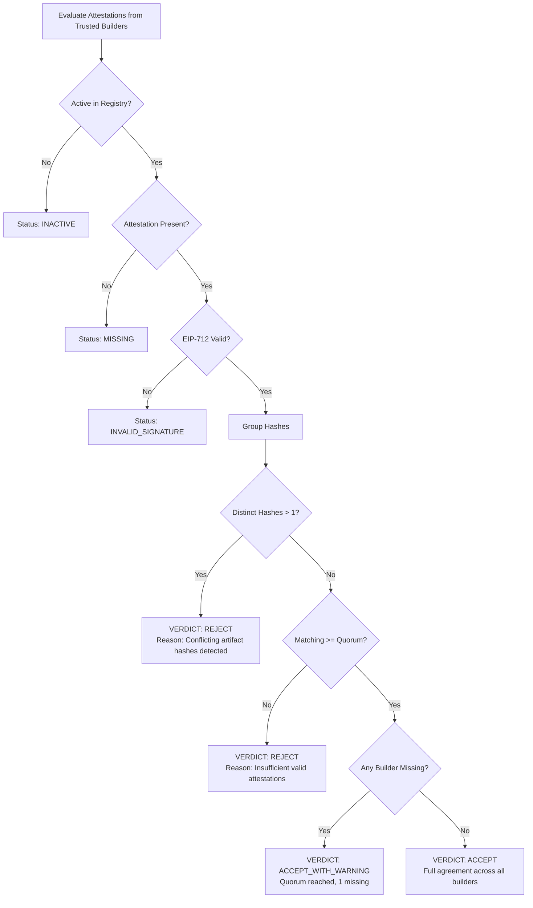

# Controlled Attack & Divergence Demonstration

## Scenario
A controlled demonstration of **multi-builder reproducibility divergence** using independent build evidence. 

In this simulation:
- Upstream software release: [`junegunn/fzf`](https://github.com/junegunn/fzf.git) tag `v0.74.4` (pinned commit `a140afeb4d733cad3c96a56bf6db7e26853b6757`).
- Consumer trust policy: Requires a **2-of-3 quorum** among trusted builders (Builder A, Builder B, Builder C).
- Builders A and B independently reproduce the exact canonical binary.
- Builder C produces a different artifact SHA-256 hash (simulating non-determinism, build environment drift, or unauthorized build pipeline modification).

---

## Baseline Evidence
Builders A and B independently compile the pinned commit inside isolated containerized environments and obtain the canonical artifact SHA-256:

```text
bed7753055d2c42d9c89e18b717645c9de05c8e0cc5cfb2fbf35959b9ac770a3
```

---

## Controlled Modification
To simulate artifact divergence safely without executing foreign binaries or introducing malware, a deterministic copy was created at [`artifacts/forensic/fzf-builder-c-tampered`](file:///c:/Users/user/Desktop/Quorum/artifacts/forensic/fzf-builder-c-tampered) with a harmless trailing marker appended:

```text
# QUORUM_CONTROLLED_DEMO_BUILDER_C_TAMPERED_MARKER
```

The original reference artifact remains completely unmodified.

---

## Forensic Comparison

Forensic analysis recorded in [`artifacts/forensic/attack-evidence.json`](file:///c:/Users/user/Desktop/Quorum/artifacts/forensic/attack-evidence.json):

| Metric | Reference / Builder A & B | Builder C (Tampered Copy) |
| :--- | :--- | :--- |
| **Artifact SHA-256** | `bed7753055d2c42d9c89e18b717645c9de05c8e0cc5cfb2fbf35959b9ac770a3` | `3010ad9c3c9dd74a459df2d00481949b26bad298bd8d8cbd2a0ef26aa5767801` |
| **File Size (Bytes)** | `4,690,072` bytes | `4,690,124` bytes |
| **Difference Offset** | Byte `4690072` (Appended marker) | Byte `4690072` |
| **Binary Execution** | **NOT PERFORMED** | **NOT PERFORMED** |

---

## Cryptographic EIP-712 Signatures
Builder C signs the modified artifact hash using its own secp256k1 private key under the standard Quorum EIP-712 domain:

- **Signer Identity**: `0x90F79bf6EB2c4f870365E785982E1f101E93b906` (Builder C)
- **Signed Payload**: Includes `releaseId`, `repository`, `releaseTag`, `sourceCommit`, and `artifactHash = 3010ad9c...`.
- **Signature Status**: `VALID` (the signature genuinely originates from Builder C).

This confirms that Quorum detects **divergent build evidence among valid trusted signers**, rather than merely rejecting forged signatures.

---

## Quorum Engine Decision Matrix



### Demonstration Scenarios

### Scenario 1: Full Agreement (3/3)
- **Builder A**: `bed77530...` (VALID)
- **Builder B**: `bed77530...` (VALID)
- **Builder C**: `bed77530...` (VALID)
- **Verdict**: `ACCEPT`
- **Reason**: Full agreement from all 3 trusted builders.

### Scenario 2: Builder C Missing (2/3)
- **Builder A**: `bed77530...` (VALID)
- **Builder B**: `bed77530...` (VALID)
- **Builder C**: `MISSING` (No attestation submitted)
- **Verdict**: `ACCEPT_WITH_WARNING`
- **Reason**: Quorum threshold (2) reached, but 1 trusted builder is offline or missing.

### Scenario 3: Builder C Divergence / Conflict (2 vs 1)
- **Builder A**: `bed77530...` (VALID)
- **Builder B**: `bed77530...` (VALID)
- **Builder C**: `3010ad9c...` (CONFLICTING)
- **Verdict**: `REJECT`
- **Reason**: Quorum was reached by Builders A and B, but Builder C submitted a conflicting artifact hash.

---

## Security Interpretation
1. **Fact-Based Evidence**: The verifier makes no speculative claims about intent or malice. It simply establishes whether trusted builders agree on the reproduced artifact.
2. **Equivocation Detection**: If Builder C resubmits an attestation, the `AttestationRegistry` automatically flags equivocation and preserves historical evidence while updating current status.
3. **Threshold Boundary**: Quorum guarantees consensus among trusted builders, but cannot prove absolute correctness if an attacker compromises more than $N - M$ builders ($3 - 2 = 1$). A $2$-of-$3$ threshold tolerates at most $1$ offline builder and immediately flags $1$ dissenting builder as a conflict.
